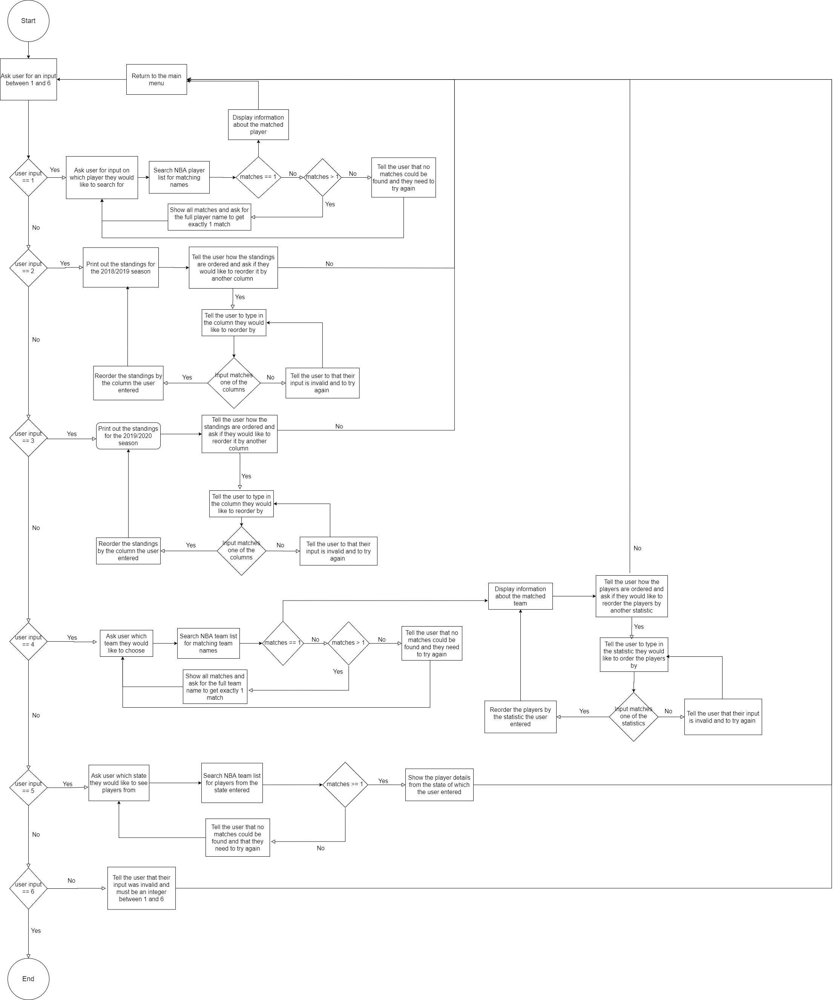

## Description of my Python application that provides two-way communication:

This application I have built queries the SportsData NBA API. 
The urls for the APIs are: 
* https://api.sportsdata.io/v3/nba/scores/json/Players
* https://api.sportsdata.io/v3/nba/scores/json/teams
* https://api.sportsdata.io/v3/nba/scores/json/Standings/{season number}
* https://api.sportsdata.io/v3/nba/scores/json/CurrentSeason

Be careful using these APIs, some of the data is scrambled. 
My application only references the unscrambled data.

The application should be run using python version 3.8.
Hence type python3.8 main.py to run the application.

Input is handled in the main menu by checking that it is an integer between
1 and 6. If the value entered is not between 1 and 6 then a ValueError is 
raised and handled by the except block. Users are then told that their
input is invalid and must be an integer between 1 and 6.

There are also sections of the application where 'y' or 'n' input is required.
If the input is not a 'y' or a 'n' then the user is told that their 
entry is invalid and must be entered again.

The solution is structured with various classes. They are Team, Team Standing,
Season, Player and Data_Handler. Every team has a list of player objects and 
every Season gets given 30 Team Standings. The Data Handler class contains 
3 dictionaries: one each for seasons, players, teams. Therefore the crucial 
data is stored within the data handler as the name suggests. 

The Data Handler classes contains all the season, player and team objects 
in dictionaries. I therefore decided to include many class methods in the 
data handler which query the dictionaries for particular season, player or 
team objects.

I abstracted the complexity of the Data Handler class away by putting it in a 
seperate module to the main class. This way, the main.py file just needs
to import the Data Handler clas and call the correct functions on it.
The main menu is in the main.py file and the main.py file handles all
of the user input. 

The application uses the follows modules for the following purposes:
The typing module is used for type annotations
The unittest module is used to import functionality to test my code
The requests module is used so that the python file may make API requests
The json module converts the returned API json text into python code.
The relativedate python file is a copy of the relativedate module and
is used to calculate the number of years between two dates

Before running the application, please ensure that all of these modules 
have been installed in your environment. Also the application requires 
Python version 3.8 so please install that version before running the
application.

